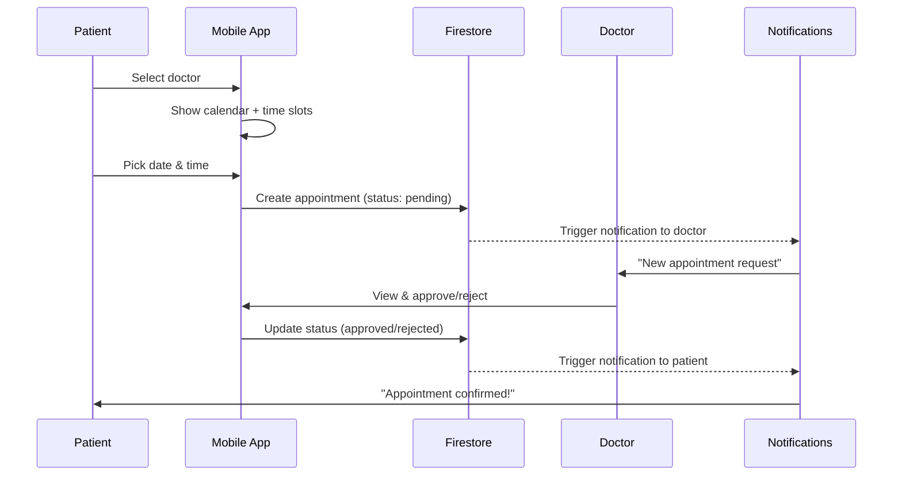
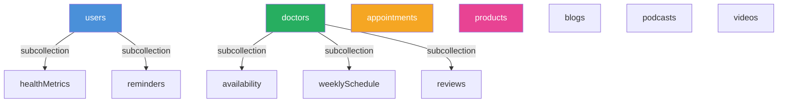

# Neem Diabetes Care App — Backend Architecture Guide

> A comprehensive technical guide for integrating Firebase, building an admin system, appointment management, and a doctor dashboard.

---

## Table of Contents

1. [Project Analysis](#1-project-analysis)
2. [Firebase Integration](#2-firebase-integration)
3. [Admin System](#3-admin-system)
4. [Appointment Management](#4-appointment-management)
5. [Doctor Dashboard](#5-doctor-dashboard)
6. [Database Structure](#6-database-structure)
7. [Folder Structure](#7-folder-structure)
8. [Step-by-Step Implementation](#8-step-by-step-implementation)
9. [Security & Scalability](#9-security--scalability)

---

## 1. Project Analysis

### Current State

| Aspect | Details |
|--------|---------|
| **Framework** | Expo SDK 54, React Native 0.81.5 |
| **Navigation** | React Navigation 7 (native stack + bottom tabs) |
| **State** | `CartContext` only — no global auth or data state |
| **Data** | All hardcoded in `mock.ts`, `shopData.ts`, `AppointmentsScreen.tsx` |
| **Auth** | Placeholder `AuthScreen.tsx` — no real authentication |
| **Screens** | 27 screens including onboarding, home, appointments, marketplace, health tracking |

### What Needs Backend

| Feature | Currently | Needs |
|---------|-----------|-------|
| Authentication | Placeholder | Firebase Auth (email/password, Google, Apple) |
| User Profile | Hardcoded | Firestore `users` collection |
| Onboarding Data | Local state only | Save to Firestore after completion |
| Appointments | Static `DOCTORS` array | Firestore with real-time booking |
| Health Metrics | Hardcoded in `mock.ts` | Firestore subcollections per user |
| Marketplace | Static `shopData.ts` | Firestore `products` collection |
| Blog/Podcasts | Hardcoded arrays | Firestore CMS-like collections |
| Reminders | No persistence | Firestore + push notifications |

---

## 2. Firebase Integration

### 2.1 Setup & Installation

```bash
npx expo install firebase
npx expo install @react-native-async-storage/async-storage
npx expo install expo-notifications
```

> [!IMPORTANT]
> Use the **Firebase JS SDK (modular v10+)** with Expo, not `@react-native-firebase`. The JS SDK works with Expo Go and doesn't require native modules.

### 2.2 Firebase Config

Create `src/config/firebase.ts`:

```typescript
import { initializeApp } from 'firebase/app';
import { initializeAuth, getReactNativePersistence } from 'firebase/auth';
import { getFirestore } from 'firebase/firestore';
import { getStorage } from 'firebase/storage';
import AsyncStorage from '@react-native-async-storage/async-storage';

const firebaseConfig = {
  apiKey: "YOUR_API_KEY",
  authDomain: "YOUR_PROJECT.firebaseapp.com",
  projectId: "YOUR_PROJECT_ID",
  storageBucket: "YOUR_PROJECT.appspot.com",
  messagingSenderId: "YOUR_SENDER_ID",
  appId: "YOUR_APP_ID",
};

const app = initializeApp(firebaseConfig);

export const auth = initializeAuth(app, {
  persistence: getReactNativePersistence(AsyncStorage),
});

export const db = getFirestore(app);
export const storage = getStorage(app);
```

### 2.3 Firebase Authentication

**Supported Methods:**
- Email/Password (primary)
- Google Sign-In
- Apple Sign-In

Create `src/services/auth.ts`:

```typescript
import {
  createUserWithEmailAndPassword,
  signInWithEmailAndPassword,
  signOut,
  onAuthStateChanged,
  User,
} from 'firebase/auth';
import { doc, setDoc, serverTimestamp } from 'firebase/firestore';
import { auth, db } from '../config/firebase';

// Sign up
export async function signUp(email: string, password: string, username: string) {
  const credential = await createUserWithEmailAndPassword(auth, email, password);
  const user = credential.user;

  // Create user document in Firestore
  await setDoc(doc(db, 'users', user.uid), {
    uid: user.uid,
    email,
    username,
    role: 'patient',           // 'patient' | 'doctor' | 'admin'
    createdAt: serverTimestamp(),
    onboardingComplete: false,
    profile: {
      age: null,
      height: null,
      weight: null,
      targetWeight: null,
      diabetesType: null,
      activityLevel: null,
      goals: [],
      medicalConditions: [],
    },
  });

  return user;
}

// Sign in
export async function signIn(email: string, password: string) {
  return signInWithEmailAndPassword(auth, email, password);
}

// Sign out
export async function logOut() {
  return signOut(auth);
}

// Auth state listener
export function onAuthChange(callback: (user: User | null) => void) {
  return onAuthStateChanged(auth, callback);
}
```

### 2.4 Auth Context

Create `src/context/AuthContext.tsx`:

```typescript
import { createContext, useContext, useEffect, useState, ReactNode } from 'react';
import { User } from 'firebase/auth';
import { doc, getDoc } from 'firebase/firestore';
import { onAuthChange } from '../services/auth';
import { db } from '../config/firebase';

interface UserData {
  uid: string;
  email: string;
  username: string;
  role: 'patient' | 'doctor' | 'admin';
  onboardingComplete: boolean;
  profile: Record<string, any>;
}

interface AuthContextType {
  user: User | null;
  userData: UserData | null;
  loading: boolean;
}

const AuthContext = createContext<AuthContextType>({
  user: null,
  userData: null,
  loading: true,
});

export function AuthProvider({ children }: { children: ReactNode }) {
  const [user, setUser] = useState<User | null>(null);
  const [userData, setUserData] = useState<UserData | null>(null);
  const [loading, setLoading] = useState(true);

  useEffect(() => {
    const unsubscribe = onAuthChange(async (firebaseUser) => {
      setUser(firebaseUser);
      if (firebaseUser) {
        const snap = await getDoc(doc(db, 'users', firebaseUser.uid));
        setUserData(snap.data() as UserData);
      } else {
        setUserData(null);
      }
      setLoading(false);
    });
    return unsubscribe;
  }, []);

  return (
    <AuthContext.Provider value={{ user, userData, loading }}>
      {children}
    </AuthContext.Provider>
  );
}

export const useAuth = () => useContext(AuthContext);
```

### 2.5 Navigation Flow with Auth

```
App Start
  └─ AuthProvider wraps everything
       ├─ loading === true  →  SplashScreen
       ├─ user === null     →  Welcome → Login / SignUp
       ├─ !onboardingComplete → Onboarding
       └─ onboardingComplete  → Main (Home tabs)
```

Update `RootNavigator.tsx` to use `useAuth()`:

```typescript
export function RootNavigator() {
  const { user, userData, loading } = useAuth();

  if (loading) return <SplashScreen />;

  return (
    <Stack.Navigator screenOptions={{ headerShown: false }}>
      {!user ? (
        // Auth flow
        <>
          <Stack.Screen name="Welcome" component={WelcomeScreen} />
          <Stack.Screen name="Login" component={LoginScreen} />
          <Stack.Screen name="SignUp" component={SignUpScreen} />
        </>
      ) : !userData?.onboardingComplete ? (
        // Onboarding
        <Stack.Screen name="Onboarding" component={OnboardingScreen} />
      ) : (
        // Main app
        <>
          <Stack.Screen name="Main" component={MainTabs} />
          {/* ... other screens */}
        </>
      )}
    </Stack.Navigator>
  );
}
```

### 2.6 Storage (Firebase Storage)

Used for:
- User profile photos
- Doctor profile images (admin-uploaded)
- Blog post images
- Product images

```typescript
// src/services/storage.ts
import { ref, uploadBytes, getDownloadURL } from 'firebase/storage';
import { storage } from '../config/firebase';

export async function uploadProfilePhoto(uid: string, uri: string) {
  const response = await fetch(uri);
  const blob = await response.blob();
  const storageRef = ref(storage, `profiles/${uid}/photo.jpg`);
  await uploadBytes(storageRef, blob);
  return getDownloadURL(storageRef);
}
```

---

## 3. Admin System

### 3.1 Recommendation: Separate Web Dashboard

> [!TIP]
> Build the admin panel as a **separate React web app** (not inside the mobile app). This gives you full desktop functionality, table views, bulk operations, and analytics charts.

| Option | Pros | Cons |
|--------|------|------|
| **Separate Web (Recommended)** | Full desktop UI, tables, charts, bulk actions | Need to build & host separately |
| **In-App Admin Tab** | Single codebase | Poor UX for admin tasks on mobile |

**Tech Stack for Admin:**
- **Next.js** or **Vite + React** for the web app
- Same Firebase project — shared Firestore, Auth, Storage
- **Tailwind CSS** + component library (e.g., shadcn/ui)

### 3.2 Role-Based Access Control

```
Roles:
  ├─ patient   →  Mobile app (full features)
  ├─ doctor    →  Mobile app (doctor dashboard tab) + limited web access
  └─ admin     →  Web dashboard (full control)
```

**Firestore user document includes `role` field:**

```typescript
// users/{uid}
{
  role: 'patient' | 'doctor' | 'admin',
  // ...
}
```

**Frontend enforcement:**

```typescript
// In navigation — show different tabs based on role
const { userData } = useAuth();

if (userData?.role === 'doctor') {
  // Show doctor-specific tabs: Dashboard, Appointments, Patients
}
```

### 3.3 What Admin Can Manage

| Content | Collection | Admin Actions |
|---------|-----------|---------------|
| Doctors | `doctors` | Add, edit, deactivate profiles |
| Appointments | `appointments` | View all, reassign, cancel |
| Blog Posts | `blogs` | Create, edit, publish/unpublish |
| Podcasts | `podcasts` | Upload, edit metadata |
| Products | `products` | Add, update price/stock, remove |
| Videos | `videos` | Upload, categorize, manage |
| Users | `users` | View, change roles, deactivate |
| Reminders | (admin broadcast) | Send global health reminders |

### 3.4 Admin Web Architecture

```
admin-dashboard/
├── src/
│   ├── app/                    # Next.js pages
│   │   ├── login/
│   │   ├── dashboard/
│   │   ├── doctors/
│   │   ├── appointments/
│   │   ├── content/            # Blogs, podcasts, videos
│   │   ├── marketplace/
│   │   └── users/
│   ├── components/
│   ├── services/               # Shared Firebase services
│   └── config/
│       └── firebase.ts         # Same Firebase project
├── package.json
└── next.config.js
```

---

## 4. Appointment Management

### 4.1 Booking Flow



### 4.2 Appointment Statuses

```
pending → approved → completed
    │         │
    └→ cancelled ←┘
    └→ rejected
```

| Status | Who Sets It | Next States |
|--------|-------------|-------------|
| `pending` | Patient (on book) | `approved`, `rejected`, `cancelled` |
| `approved` | Doctor | `completed`, `cancelled` |
| `rejected` | Doctor | (terminal) |
| `cancelled` | Patient or Doctor | (terminal) |
| `completed` | Doctor (after visit) | (terminal) |

### 4.3 Appointment Schema

```typescript
// appointments/{appointmentId}
{
  id: string;                  // auto-generated
  patientId: string;           // users/{uid}
  doctorId: string;            // doctors/{id}
  date: Timestamp;             // selected appointment date/time
  timeSlot: string;            // "10:00 AM"
  status: 'pending' | 'approved' | 'rejected' | 'cancelled' | 'completed';
  reason: string;              // why the patient booked
  notes: string;               // doctor's notes (post-visit)
  createdAt: Timestamp;
  updatedAt: Timestamp;
  cancelledBy: string | null;  // 'patient' | 'doctor'
  cancelReason: string | null;
}
```

### 4.4 Doctor Availability Schema

```typescript
// doctors/{doctorId}/availability/{dayId}
{
  date: Timestamp;              // the specific date
  dayOfWeek: number;            // 0-6 (Sun-Sat)
  slots: [
    { time: '9:00 AM',  booked: false },
    { time: '9:30 AM',  booked: true, appointmentId: 'abc123' },
    { time: '10:00 AM', booked: false },
    // ...
  ],
}
```

**Recurring availability template:**

```typescript
// doctors/{doctorId}/weeklySchedule
{
  monday:    { start: '9:00 AM', end: '5:00 PM', slotDuration: 30 },
  tuesday:   { start: '9:00 AM', end: '5:00 PM', slotDuration: 30 },
  wednesday: { start: '9:00 AM', end: '1:00 PM', slotDuration: 30 },
  thursday:  null, // day off
  friday:    { start: '10:00 AM', end: '4:00 PM', slotDuration: 30 },
  saturday:  null,
  sunday:    null,
}
```

### 4.5 Booking Service

```typescript
// src/services/appointments.ts
import {
  addDoc, collection, doc, updateDoc, query, where,
  orderBy, onSnapshot, Timestamp, serverTimestamp, getDoc,
} from 'firebase/firestore';
import { db } from '../config/firebase';

export async function bookAppointment(
  patientId: string,
  doctorId: string,
  date: Date,
  timeSlot: string,
  reason: string,
) {
  // 1. Check slot availability
  const slotRef = doc(db, 'doctors', doctorId, 'availability', dateKey(date));
  const slotSnap = await getDoc(slotRef);
  const slots = slotSnap.data()?.slots || [];
  const slot = slots.find((s: any) => s.time === timeSlot);

  if (slot?.booked) throw new Error('Slot already booked');

  // 2. Create appointment
  const appointmentRef = await addDoc(collection(db, 'appointments'), {
    patientId,
    doctorId,
    date: Timestamp.fromDate(date),
    timeSlot,
    status: 'pending',
    reason,
    notes: '',
    createdAt: serverTimestamp(),
    updatedAt: serverTimestamp(),
    cancelledBy: null,
    cancelReason: null,
  });

  // 3. Mark slot as booked
  const updatedSlots = slots.map((s: any) =>
    s.time === timeSlot ? { ...s, booked: true, appointmentId: appointmentRef.id } : s
  );
  await updateDoc(slotRef, { slots: updatedSlots });

  return appointmentRef.id;
}

// Listen to patient's appointments
export function listenToMyAppointments(
  patientId: string,
  callback: (appointments: any[]) => void,
) {
  const q = query(
    collection(db, 'appointments'),
    where('patientId', '==', patientId),
    orderBy('date', 'desc'),
  );
  return onSnapshot(q, (snapshot) => {
    callback(snapshot.docs.map(d => ({ id: d.id, ...d.data() })));
  });
}
```

### 4.6 Notifications

Use **Firebase Cloud Functions** + **Expo Push Notifications**:

```typescript
// Cloud Function (functions/src/index.ts)
import * as functions from 'firebase-functions';
import { Expo } from 'expo-server-sdk';

const expo = new Expo();

export const onAppointmentCreated = functions.firestore
  .document('appointments/{appointmentId}')
  .onCreate(async (snap) => {
    const data = snap.data();
    const doctorDoc = await snap.ref.firestore.doc(`doctors/${data.doctorId}`).get();
    const pushToken = doctorDoc.data()?.pushToken;

    if (pushToken) {
      await expo.sendPushNotificationsAsync([{
        to: pushToken,
        title: 'New Appointment Request',
        body: `Patient has requested an appointment for ${data.timeSlot}`,
        data: { appointmentId: snap.id },
      }]);
    }
  });
```

---

## 5. Doctor Dashboard

### 5.1 Features

| Feature | Description |
|---------|-------------|
| **View Appointments** | Today's schedule, upcoming, past, filtered by status |
| **Manage Availability** | Set weekly hours, block specific dates, adjust slot duration |
| **Patient Details** | View patient profile, health metrics, appointment history |
| **Update Status** | Approve/reject pending, mark as completed, add notes |
| **Analytics** | Total patients, appointments this month, ratings (optional) |

### 5.2 Doctor Screen Flow

```
Doctor Tab (bottom tab visible to role='doctor')
  ├── Dashboard Home
  │     ├── Today's appointments (list)
  │     ├── Quick stats (pending, today, this week)
  │     └── Upcoming appointments
  ├── Schedule Manager
  │     ├── Weekly availability editor
  │     ├── Date-specific overrides
  │     └── Block/unblock dates
  ├── Patients
  │     ├── Patient list (searchable)
  │     └── Patient detail → health metrics, history
  └── Profile
        ├── Edit bio, specialties, price
        └── View ratings & reviews
```

### 5.3 Doctor Services

```typescript
// src/services/doctor.ts

// Get doctor's appointments for a specific date
export function listenToDoctorAppointments(
  doctorId: string,
  date: Date,
  callback: (appointments: any[]) => void,
) {
  const startOfDay = new Date(date); startOfDay.setHours(0, 0, 0, 0);
  const endOfDay = new Date(date); endOfDay.setHours(23, 59, 59, 999);

  const q = query(
    collection(db, 'appointments'),
    where('doctorId', '==', doctorId),
    where('date', '>=', Timestamp.fromDate(startOfDay)),
    where('date', '<=', Timestamp.fromDate(endOfDay)),
    orderBy('date', 'asc'),
  );
  return onSnapshot(q, (snap) => {
    callback(snap.docs.map(d => ({ id: d.id, ...d.data() })));
  });
}

// Update appointment status
export async function updateAppointmentStatus(
  appointmentId: string,
  status: string,
  notes?: string,
) {
  await updateDoc(doc(db, 'appointments', appointmentId), {
    status,
    notes: notes || '',
    updatedAt: serverTimestamp(),
  });
}

// Update weekly schedule
export async function updateWeeklySchedule(
  doctorId: string,
  schedule: Record<string, any>,
) {
  await setDoc(doc(db, 'doctors', doctorId, 'weeklySchedule', 'default'), schedule);
}
```

---

## 6. Database Structure

### 6.1 Firestore Collections Diagram



### 6.2 Collection Schemas

#### `users/{uid}`

```typescript
{
  uid: string;
  email: string;
  username: string;
  role: 'patient' | 'doctor' | 'admin';
  photoURL: string | null;
  pushToken: string | null;
  createdAt: Timestamp;
  onboardingComplete: boolean;
  profile: {
    age: number | null;
    height: number | null;          // cm
    weight: number | null;          // kg
    targetWeight: number | null;    // kg
    diabetesType: string | null;    // 'type1' | 'type2' | 'prediabetes' | 'unknown'
    activityLevel: string | null;   // 'not_active' | 'moderate' | 'very_active'
    goals: string[];                // ['glucose', 'weight', 'eating', ...]
    medicalConditions: string[];    // ['hbp', 'heart', ...]
  };
  settings: {
    language: string;               // 'en', 'rw', 'fr'
    units: {
      weight: 'kg' | 'lbs';
      height: 'cm' | 'feet';
      glucose: 'mg/dL' | 'mmol/L';
    };
    notifications: boolean;
  };
}
```

#### `users/{uid}/healthMetrics/{metricId}`

```typescript
{
  type: 'glucose' | 'weight' | 'water' | 'hba1c' | 'bloodpressure' | 'activity';
  value: number;
  value2: number | null;    // for blood pressure (diastolic)
  unit: string;
  recordedAt: Timestamp;
  notes: string;
}
```

#### `users/{uid}/reminders/{reminderId}`

```typescript
{
  title: string;
  category: string;          // 'medication' | 'glucose' | 'meal' | 'exercise'
  time: string;              // '08:00 AM'
  days: string[];            // ['Mon', 'Wed', 'Fri']
  enabled: boolean;
  createdAt: Timestamp;
}
```

#### `doctors/{doctorId}`

```typescript
{
  id: string;
  userId: string;            // links to users/{uid} if doctor has app account
  name: string;
  specialty: string;
  image: string;             // Storage URL
  rating: number;
  reviewCount: number;
  patients: string;          // '1200+'
  experience: string;        // '10 Years'
  price: number;             // in cents or smallest currency unit
  currency: string;          // 'USD', 'RWF'
  about: string;
  available: boolean;
  createdAt: Timestamp;
}
```

#### `products/{productId}`

```typescript
{
  id: string;
  name: string;
  description: string;
  price: number;
  currency: string;
  image: string;
  category: string;          // 'Monitors', 'Test Strips', etc.
  tag: string;               // 'Best Seller', 'New', etc.
  inStock: boolean;
  stockCount: number;
  rating: number;
  reviewCount: number;
  createdAt: Timestamp;
}
```

#### `blogs/{blogId}`

```typescript
{
  id: string;
  title: string;
  content: string;           // rich text or markdown
  excerpt: string;
  image: string;
  category: string;
  readTime: string;          // '6 min'
  author: string;
  published: boolean;
  publishedAt: Timestamp;
  createdAt: Timestamp;
}
```

### 6.3 Indexes Required

| Collection | Fields | Type |
|-----------|--------|------|
| `appointments` | `patientId` + `date` DESC | Composite |
| `appointments` | `doctorId` + `date` ASC | Composite |
| `appointments` | `doctorId` + `status` | Composite |
| `healthMetrics` | `type` + `recordedAt` DESC | Composite |
| `products` | `category` + `createdAt` DESC | Composite |
| `blogs` | `published` + `publishedAt` DESC | Composite |

---

## 7. Folder Structure

### Mobile App (Updated)

```
src/
├── config/
│   └── firebase.ts              # Firebase init
├── context/
│   ├── AuthContext.tsx           # Auth state provider
│   └── CartContext.tsx           # Shopping cart (existing)
├── services/
│   ├── auth.ts                  # Sign up, sign in, sign out
│   ├── appointments.ts          # Book, cancel, listen
│   ├── doctor.ts                # Doctor-specific operations
│   ├── healthMetrics.ts         # Log/read glucose, weight, etc.
│   ├── reminders.ts             # CRUD reminders
│   ├── content.ts               # Fetch blogs, podcasts, videos
│   ├── products.ts              # Fetch shop products
│   ├── storage.ts               # Upload/download files
│   └── notifications.ts         # Push notification setup
├── hooks/
│   ├── useAuth.ts               # Re-export from AuthContext
│   ├── useAppointments.ts       # React hook for appointments
│   ├── useHealthMetrics.ts      # React hook for health data
│   └── useDoctor.ts             # React hook for doctor data
├── types/
│   ├── user.ts                  # UserData, Profile types
│   ├── appointment.ts           # Appointment types
│   ├── doctor.ts                # Doctor types
│   └── health.ts                # Health metric types
├── components/                  # (existing 17 components)
├── screens/                     # (existing 27 screens)
├── navigation/
│   ├── types.ts
│   ├── RootNavigator.tsx
│   └── MainTabs.tsx
├── data/                        # Remove once Firebase is connected
│   ├── mock.ts
│   └── shopData.ts
└── theme/                       # (existing)
```

### Admin Web Dashboard

```
admin-dashboard/
├── src/
│   ├── app/
│   │   ├── layout.tsx
│   │   ├── page.tsx             # Dashboard home
│   │   ├── login/
│   │   ├── doctors/
│   │   │   ├── page.tsx         # List all doctors
│   │   │   └── [id]/page.tsx    # Edit doctor
│   │   ├── appointments/
│   │   │   └── page.tsx         # All appointments table
│   │   ├── content/
│   │   │   ├── blogs/
│   │   │   ├── podcasts/
│   │   │   └── videos/
│   │   ├── marketplace/
│   │   │   └── page.tsx         # Products management
│   │   └── users/
│   │       └── page.tsx         # User management
│   ├── components/
│   │   ├── Sidebar.tsx
│   │   ├── DataTable.tsx
│   │   └── Charts.tsx
│   ├── lib/
│   │   └── firebase.ts          # Same Firebase project
│   └── styles/
├── package.json
└── next.config.js
```

---

## 8. Step-by-Step Implementation

### Phase 1: Foundation (Week 1)

| # | Task | Priority |
|---|------|----------|
| 1 | Create Firebase project in console | 🔴 Critical |
| 2 | Install `firebase` + `@react-native-async-storage/async-storage` | 🔴 Critical |
| 3 | Create `src/config/firebase.ts` | 🔴 Critical |
| 4 | Create `src/services/auth.ts` | 🔴 Critical |
| 5 | Create `src/context/AuthContext.tsx` | 🔴 Critical |
| 6 | Wire `AuthProvider` into `App.tsx` | 🔴 Critical |
| 7 | Connect `LoginScreen` + `SignUpScreen` to real Firebase Auth | 🔴 Critical |
| 8 | Update `RootNavigator` for conditional auth-based navigation | 🔴 Critical |

### Phase 2: User Data (Week 2)

| # | Task | Priority |
|---|------|----------|
| 9 | Save onboarding answers to Firestore `users/{uid}.profile` | 🟡 High |
| 10 | Create `src/services/healthMetrics.ts` — log & fetch metrics | 🟡 High |
| 11 | Connect health tracking modals (glucose, weight, water, HbA1c, BP) to Firestore | 🟡 High |
| 12 | Create `src/services/reminders.ts` — CRUD reminders with Firestore | 🟡 High |
| 13 | Update `ProfileScreen` to read/write real user data | 🟡 High |

### Phase 3: Appointments (Week 3)

| # | Task | Priority |
|---|------|----------|
| 14 | Create `doctors` collection in Firestore (migrate from hardcoded `DOCTORS` array) | 🟡 High |
| 15 | Create `src/services/appointments.ts` | 🟡 High |
| 16 | Create `src/services/doctor.ts` | 🟡 High |
| 17 | Update `AppointmentsScreen` to fetch doctors from Firestore | 🟡 High |
| 18 | Update `DoctorDetailScreen` to use real availability + booking | 🟡 High |
| 19 | Set up Expo Push Notifications | 🟡 High |
| 20 | Create Cloud Function for appointment notifications | 🟡 High |

### Phase 4: Content & Shop (Week 4)

| # | Task | Priority |
|---|------|----------|
| 21 | Migrate `shopData.ts` → Firestore `products` collection | 🟢 Medium |
| 22 | Migrate blog posts, podcasts, videos to Firestore | 🟢 Medium |
| 23 | Create `src/services/content.ts` + `products.ts` | 🟢 Medium |
| 24 | Update `MarketplaceScreen`, `BlogsScreen`, `PodcastsScreen` | 🟢 Medium |

### Phase 5: Admin Dashboard (Weeks 5-6)

| # | Task | Priority |
|---|------|----------|
| 25 | Create Next.js admin project | 🟢 Medium |
| 26 | Build admin login with role check | 🟢 Medium |
| 27 | Build doctor management CRUD pages | 🟢 Medium |
| 28 | Build appointment overview with filters | 🟢 Medium |
| 29 | Build content management (blogs, podcasts, videos) | 🟢 Medium |
| 30 | Build product management | 🟢 Medium |

### Phase 6: Doctor Dashboard (Week 7)

| # | Task | Priority |
|---|------|----------|
| 31 | Create doctor-specific bottom tab navigator | 🟢 Medium |
| 32 | Build doctor dashboard home screen | 🟢 Medium |
| 33 | Build schedule/availability manager | 🟢 Medium |
| 34 | Build patient list and detail view | 🟢 Medium |

---

## 9. Security & Scalability

### 9.1 Firestore Security Rules

```javascript
rules_version = '2';
service cloud.firestore {
  match /databases/{database}/documents {

    // ── Helper functions ──────────────────────
    function isAuth() { return request.auth != null; }
    function isOwner(uid) { return request.auth.uid == uid; }
    function isAdmin() {
      return isAuth() &&
        get(/databases/$(database)/documents/users/$(request.auth.uid)).data.role == 'admin';
    }
    function isDoctor() {
      return isAuth() &&
        get(/databases/$(database)/documents/users/$(request.auth.uid)).data.role == 'doctor';
    }

    // ── Users ─────────────────────────────────
    match /users/{uid} {
      allow read: if isAuth() && (isOwner(uid) || isAdmin());
      allow create: if isOwner(uid);
      allow update: if isOwner(uid) || isAdmin();
      allow delete: if isAdmin();

      match /healthMetrics/{metricId} {
        allow read, write: if isOwner(uid);
      }
      match /reminders/{reminderId} {
        allow read, write: if isOwner(uid);
      }
    }

    // ── Doctors ───────────────────────────────
    match /doctors/{doctorId} {
      allow read: if isAuth();
      allow write: if isAdmin();

      match /availability/{day} {
        allow read: if isAuth();
        allow write: if isAdmin() || isDoctor();
      }
      match /weeklySchedule/{doc} {
        allow read: if isAuth();
        allow write: if isAdmin() || isDoctor();
      }
      match /reviews/{reviewId} {
        allow read: if isAuth();
        allow create: if isAuth();
        allow update, delete: if isAdmin();
      }
    }

    // ── Appointments ──────────────────────────
    match /appointments/{appointmentId} {
      allow read: if isAuth() && (
        resource.data.patientId == request.auth.uid ||
        isDoctor() || isAdmin()
      );
      allow create: if isAuth();
      allow update: if isAuth() && (
        resource.data.patientId == request.auth.uid ||
        isDoctor() || isAdmin()
      );
      allow delete: if isAdmin();
    }

    // ── Public Content ────────────────────────
    match /products/{productId} {
      allow read: if true;
      allow write: if isAdmin();
    }
    match /blogs/{blogId} {
      allow read: if true;
      allow write: if isAdmin();
    }
    match /podcasts/{podcastId} {
      allow read: if true;
      allow write: if isAdmin();
    }
    match /videos/{videoId} {
      allow read: if true;
      allow write: if isAdmin();
    }
  }
}
```

### 9.2 Best Practices

| Practice | How |
|----------|-----|
| **Paginate queries** | Use `limit()` + `startAfter()` for lists |
| **Cache locally** | Use `AsyncStorage` for offline-first reads |
| **Optimize reads** | Denormalize data — store doctor name inside appointment doc |
| **Batch writes** | Use `writeBatch()` when updating multiple docs atomically |
| **Cloud Functions** | Keep business logic server-side (notifications, analytics aggregation) |
| **Input validation** | Validate on client AND in security rules |
| **Rate limiting** | Use Cloud Functions with rate limits for booking |
| **Indexes** | Create composite indexes for every compound query |
| **Environment vars** | Use `.env` for Firebase config, never commit API keys |

### 9.3 Scalability Considerations

> [!NOTE]
> Firestore scales automatically — no need to provision servers. Focus on query patterns and data modeling.

- **Denormalize** frequently read data (e.g., store doctor name + photo in each appointment doc)
- **Use subcollections** for per-user data (healthMetrics, reminders) to avoid loading all users' data
- **Shard hot documents** — if a single doctor gets 1000+ bookings/sec, use distributed counters
- **Offline support** — enable Firestore persistence for offline-first (already built into JS SDK)
- **Monitor costs** — set up Firebase billing alerts; each read/write/delete costs money

---

> **Next Steps:** Start with **Phase 1** — Firebase project creation and auth integration. The existing screens only need their data sources changed; the UI stays exactly the same.
